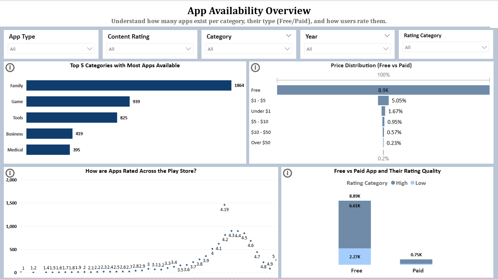
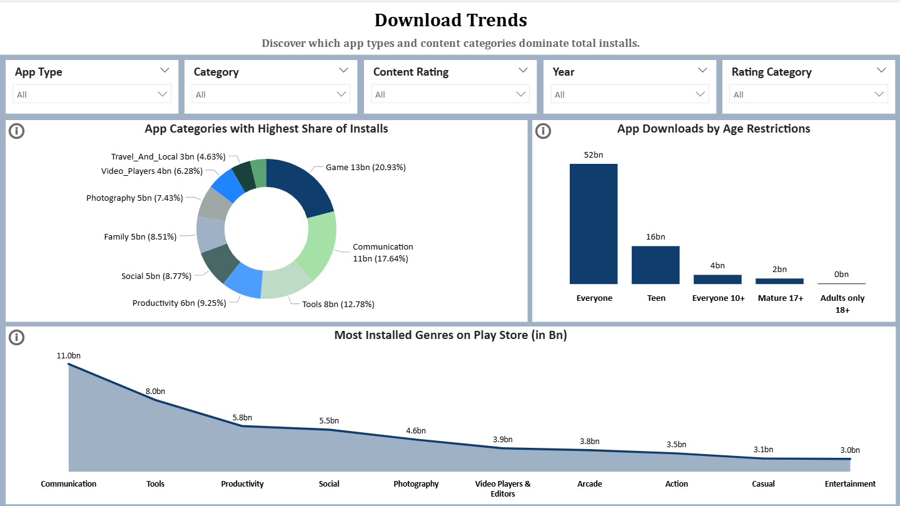
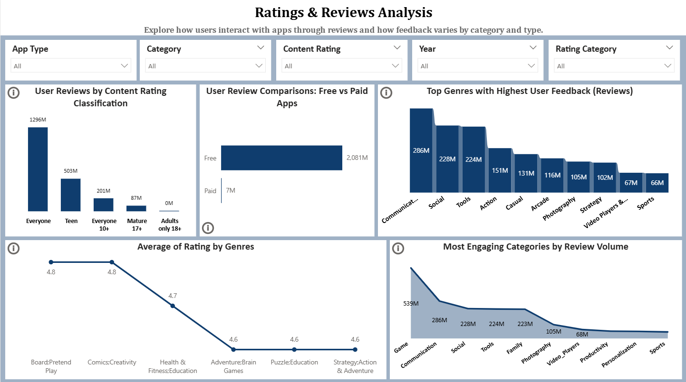
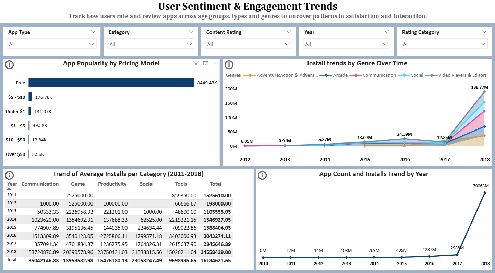

# google_playstore_eda
Exploratory Data Analysis (EDA) and visualization on Google Playstore Apps using SQL and Power BI

## Key Questions Answered:

•	What categories dominate the app market?

•	Which age groups and genres are highly engaged?

•	Free vs Paid apps comparison in terms of installs and ratings.

•	User sentiment towards app types over the years.

## Tools Used:

•	MSSQL Server

•	PowerBI

## SQL Scripts
- The complete data cleaning and transformation steps using MSSQL can be found in [google_playstore.sql](google_playstore.sql).

**Steps include:**
- Data type conversion
- Handling Null values
- Backup table creation
- Columns Rounding 
- Removing duplicates

## Dashboard Overview:
 **1. App Availability -** Top categories in volume, price distribution, ratings and free vs paid pricings.

 **2. Download Patterns**- High-performing genres and categories, app ratings.

 **3. Ratings & Reviews Analysis** - review volumes, highly engaged categories, rating trends.

 **4.User Sentiment & Engagement Trends** - Install trends across years, genre, category and price bucket.

## Dashboard Preview & Business Insights:

**1. App Availability**

 

📌 Free apps dominate the ecosystem, accounting for 92% of listings, reducing the viability of premium-only strategies.

📌 Family apps significantly lead in availability - suggesting opportunities in kid- or parent-focused experiences.

📌 Peak user satisfaction clusters at 4.1-4.5 stars with a sweet spot at 4.19, suggesting KPI benchmark for new apps.

📌 Free apps receive more negative ratings on average than paid apps, indicating users expect high quality content even without paying.

----------------------------------------------------------------------------------
**2. Download Patterns**

📌 Game and Communication apps are install magnets, making up 39% of total downloads - critical for ad-based monetization.

📌 "Everyone" content rating dominates (52bn installs), highlighting the importance of family-safe content policies.

📌 Utility-based genres like Tools and Productivity show consistent demand, supporting freemium B2C models.

----------------------------------------------------------------------------------
**3. Rating & Reviews Analysis**

📌 Customer feedback skews heavily toward the free apps, suggesting business to adopt free-to-use approach supported by in-app purchases, or tiered upgrades, for visibility and user engagement.

📌 High review volume in Communication and Social apps highlight user demand for interactive and community-driven platforms.

📌 Niche genres with high ratings (e.g., Comics, Pretend Play) present opportunities to launch small-scale, high-quality paid or subscription apps. Focus on user experience and content quality to justify premium pricing and create micro-communities.

📌 Apps targeting broader age ranges (Everyone, Teen) generate significantly more feedback, validating inclusive content strategies.

----------------------------------------------------------------------------------

**4. User Sentiment & Engagement Trends**

📌 With over 99% of installs coming from free apps, businesses should adopt free-to-use models with monetization via ads or in-app purchases.

📌 The surge in 2018 indicates late adoption or viral growth triggers - ideal for launching new apps around major trend years or global shifts.

📌 Apps in Communication, Video players and Social genres suggest exponential adoption - invest in these areas for higher ROI.

📌 Use year-wise install trend to time releases during high-growth periods (like Q1 2018) or replicate similar market conditions.

📌Apps priced above $5 see drastically fewer installs - stay below this threshold to maximize reach.

## Strategies to implement:

 **Freemium apps:**    Prioritize free apps, with in-app purchases for maximum reach and user engagement. 

 **Family-focused Content:**   Focus on family & inclusive categories to capture broader audiences. 

 **Pricing Strategy:** Keep pricing below $5 unless offering high-value features. 

**Future launch:** Historical install surges can be used for future launches of apps for market spikes. 

## Access the Dashboard
~ You can open the `.pbix` file in Power BI Desktop to explore slicers, filters, and interactive visualizations. 

